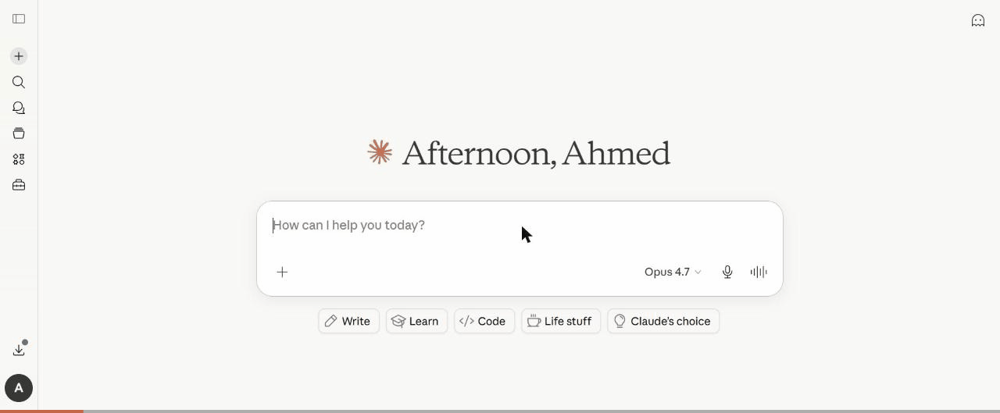
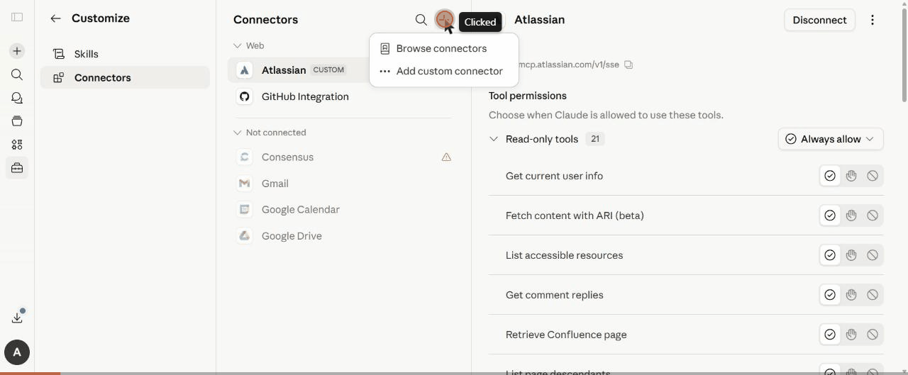

<div align="center">


# Thoth

**Agentic systematic literature reviews with verifiable citations.**

*Named for Thoth, ancient Egypt's ibis-headed god of writing and scribes — the divine patron of the work this tool automates.*

[](https://thoth-slr.vercel.app)
[](https://thoth-slr.vercel.app/evals)
[](https://registry.modelcontextprotocol.io/v0.1/servers?search=thoth)
[](https://www.typescriptlang.org/)
[](#)
[](#)
[](#)

`agentic-ai` · `langgraph` · `systematic-literature-review` · `mcp-server` · `oauth-2.1` · `next.js` · `prisma` · `trigger.dev` · `clerk` · `cite-check`

</div>

**Live app:** https://thoth-slr.vercel.app · **Public evals:** https://thoth-slr.vercel.app/evals · **MCP endpoint:** `https://thoth-slr.vercel.app/api/mcp/mcp`

Thoth turns a research question and a corpus of PDFs into an evidence-grounded literature review. A multi-step LangGraph agent (planner → retriever → assessor → drafter → critic) reads the papers, drafts the review, and runs a `cite_check` post-pass that verifies every cited claim against the source paper — flagging hallucinated citations before the user reads the draft.



*Claude.ai connected to Thoth via the [official MCP Registry](https://registry.modelcontextprotocol.io/v0.1/servers?search=thoth). After `list_reviews` surfaces a review with faithfulness 0.13, Claude calls `get_citation_audit` and identifies all 6 unsupported claims — every one citing the same paper, with invented percentages that aren't in the source. Try it: [Connect via MCP](#connect-via-mcp).*

## Verified engineering proofs

| | |
|---|---|
| **Live app** | [thoth-slr.vercel.app](https://thoth-slr.vercel.app) (Clerk sign-in) |
| **Public eval dashboard** | [`/evals`](https://thoth-slr.vercel.app/evals) — recall/precision/faithfulness/coverage over a 17-question versioned golden set (14 real-paper SLR questions across LLM/ML/SE + 3 synthetic seeds), refreshed weekly via CI |
| **Official MCP Registry entry** | [`io.github.ahmedEid1/thoth`](https://registry.modelcontextprotocol.io/v0.1/servers?search=thoth) — `status: active` |
| **Tests** | 330 unit/integration + 3 live e2e MCP smoke checks, all green; tsc + lint clean |
| **Audit log** | Every MCP tool call recorded in `McpCall` with SHA-256 input hash; no raw input ever stored |
| **Deploy cost** | $0 / month (Vercel + Neon + Cloudflare R2 + Langfuse Cloud + Trigger.dev Cloud — all free tiers) |
| **Self-host fallback** | One-VM deploy on Oracle Cloud Always Free (4 ARM cores, 24 GB RAM) — [`docs/self-host/`](docs/self-host/oracle-cloud-quickstart.md) |
| **Status** | `v1.0.1` — engineering complete; eval CI runs weekly with regression gate |

## What makes Thoth different

1. **`cite_check` post-pass.** Every `[paper_id]` citation in the generated draft is verified against the cited paper before the user reads the draft. The MCP demo above shows Claude.ai using this audit to identify 6 hallucinated statistics in a real SLR draft on the ReAct paper.
2. **Authenticated, registered MCP server.** Most public MCP servers ship with no auth. Thoth uses OAuth 2.1 + PKCE + Dynamic Client Registration via Clerk (resource-server pattern, RFC 8707), with SHA-256 audit logs and DB-backed sliding-window rate limits. Listed in the official MCP Registry; works in claude.ai, Claude Desktop (via `mcp-remote`), Cursor, and MCP Inspector.
3. **Public eval dashboard tied to main.** Every commit can run the agent against a versioned golden set; results render at `/evals`. Designed so an eval regression is a public signal, not a hidden one.
4. **6 LLM providers, `$0` default.** Switch providers via one env var (`LLM_PROVIDER=mistral|groq|gemini|anthropic|openai|claude-agent`); Mistral free tier is the default. Local eval runs can use a Claude Max subscription via `@anthropic-ai/claude-agent-sdk` without an API key.

## Connect via MCP

Thoth ships an authenticated MCP server at `https://thoth-slr.vercel.app/api/mcp/mcp` — paste this URL into claude.ai (Pro/Max), Claude Desktop, Cursor, or any MCP-compatible client. OAuth flow runs in your browser (powered by Clerk + Dynamic Client Registration); you never copy-paste a token.

**Listed in the official [MCP Registry](https://registry.modelcontextprotocol.io)** as `io.github.ahmedEid1/thoth`. Verify independently with:

```bash
curl "https://registry.modelcontextprotocol.io/v0.1/servers?search=thoth" | jq '.servers[0].server'
```

**Available tools** (all read-only, all scoped to your Thoth account):
- `list_reviews` — list your Thoth reviews with critic + faithfulness scores
- `get_review_draft` — fetch the markdown draft of a completed review
- `get_citation_audit` — fetch the per-claim cite_check verdict report

See [`docs/mcp/tools.md`](docs/mcp/tools.md) for the full tool reference and [`docs/mcp/security.md`](docs/mcp/security.md) for the auth + audit model.

**Setting it up** in claude.ai (Pro/Max — Connectors → Add custom connector → paste the URL → OAuth via Clerk + DCR, no manual client config needed):



## Stack

| Layer | Choice |
|---|---|
| App | Next.js 16 + TypeScript (strict) |
| UI | Tailwind v4 + shadcn/ui (`@base-ui/react`) + Lucide |
| Auth | Clerk (web sessions + OAuth 2.1 + DCR for MCP) |
| DB | Postgres 17 + Prisma v7 (driver adapter `@prisma/adapter-neon`) |
| Object store | S3-compatible (Cloudflare R2 in prod, MinIO local) |
| Background jobs | Trigger.dev v4 |
| Agent framework | LangGraph (TypeScript) |
| LLM dispatch | Vercel AI SDK over 6 providers (see [LLM provider](#llm-provider)) |
| PDF parsing | Mistral OCR API |
| Observability | Langfuse Cloud (OpenTelemetry exporter via `langfuse-vercel` + `@vercel/otel`) |
| MCP server | `mcp-handler` + `@clerk/mcp-tools` + `@modelcontextprotocol/sdk` |
| Tests | Vitest (unit/integration) + Playwright (e2e smoke against live deploy) |
| Deploy | Vercel + Neon (Frankfurt) + Cloudflare R2 + Langfuse Cloud + Trigger.dev Cloud |
| Self-host | docker-compose on Oracle Cloud Always Free — [`infra/self-host/`](infra/self-host/) |

## Quickstart

```bash
git clone https://github.com/ahmedEid1/thoth.git
cd thoth
cp .env.example .env       # fill in Clerk + Trigger.dev keys + MISTRAL_API_KEY
docker compose up -d       # postgres :5433, minio :9010/:9011, langfuse :3030
pnpm install
pnpm prisma migrate dev
pnpm dev                   # Next.js on :3000
pnpm dev:trigger           # Trigger.dev worker (separate terminal)
```

See [`.env.example`](.env.example) for the full env-var list. Non-obvious ones: `S3_FORCE_PATH_STYLE=true` for MinIO; `CLERK_WEBHOOK_SIGNING_SECRET` only when wiring Clerk's webhook in prod.

## Tests

```bash
pnpm test                                                                # 330 unit/integration tests
PLAYWRIGHT_BASE_URL=https://thoth-slr.vercel.app pnpm playwright test tests/e2e/mcp-smoke.spec.ts  # 3 live e2e
pnpm tsx scripts/verify-mcp-audit.ts                                     # spot-check the McpCall audit log
```

## LLM provider

Thoth uses [Vercel AI SDK](https://ai-sdk.dev) so you can swap providers via a single env var.

| Provider  | Free? | Setup                                         | Env var                          |
|-----------|-------|-----------------------------------------------|----------------------------------|
| **Mistral** (default) | ✅ Free Experiment tier | https://console.mistral.ai (30s) | `MISTRAL_API_KEY` |
| Groq      | ✅ Free | https://console.groq.com                       | `GROQ_API_KEY`                   |
| Gemini    | ✅ Free | https://aistudio.google.com                    | `GOOGLE_GENERATIVE_AI_API_KEY`   |
| Anthropic | Paid  | https://console.anthropic.com                  | `ANTHROPIC_API_KEY`              |
| OpenAI    | Paid  | https://platform.openai.com                    | `OPENAI_API_KEY`                 |
| Claude Agent SDK | ✅ Free with Max | `claude login` (Claude Code CLI)      | (CLI session — no key)           |

Mistral is the default because the Free Experiment tier covers Thoth's workload, the data stays in the EU jurisdiction, and `mistral-large-latest` produces reliable Zod-validated structured output across every node in the agent pipeline.

Switch with `LLM_PROVIDER=<name>` in `.env`. Tier choice (`smart`/`fast`) per prompt stays the same — the dispatcher maps each tier to the equivalent model per provider (see `lib/llm/tiers.ts`).

## Self-host alternative

Don't want to depend on Vercel + Neon + R2 + Langfuse Cloud? See [`docs/self-host/oracle-cloud-quickstart.md`](docs/self-host/oracle-cloud-quickstart.md) for a step-by-step walkthrough to deploy Thoth on **Oracle Cloud's Always Free** tier (4-core ARM Ampere A1 + 24 GB RAM, free forever). One VM runs Thoth + Postgres + MinIO + Langfuse behind Caddy with auto-TLS; you still use a hosted LLM API (Mistral free tier, or any of the 6 supported providers). Total recurring cost: **$0/month + ~€10/yr domain**. Config under [`infra/self-host/`](infra/self-host/).

## Built with spec-driven development

The full design is at [`docs/superpowers/specs/thoth-design.md`](docs/superpowers/specs/thoth-design.md); the build order (M1 → M6) is at [`docs/superpowers/plans/thoth-roadmap.md`](docs/superpowers/plans/thoth-roadmap.md). The release checklist is at [`RELEASING.md`](RELEASING.md). Brand guidelines: [`docs/brand.md`](docs/brand.md).

## Roadmap & changelog

- ~~**M1** — Workspace foundation~~ ✅ `v0.1.0-m1` — Clerk auth, Prisma v7, S3 object store, PDF upload + Trigger.dev parse task
- ~~**M2** — Summarisation + Langfuse observability~~ ✅ `v0.2.0-m2` — `lib/llm.ts` wrapper, `summarize-paper` task, trace per call
- ~~**M3** — Full agent loop + HITL~~ ✅ `v0.3.0-m3` — LangGraph state machine + Trigger.dev durability + approve-plan / approve-papers gates
- ~~**M3.5a** — LLM provider abstraction~~ ✅ `v0.3.5-m3.5a` — Vercel AI SDK dispatcher, 4-provider adapters, tier mapping
- ~~**M3.5b** — Cloud deploy ($0)~~ ✅ `v0.3.6-m3.5b` — Vercel + Neon + R2 + Langfuse Cloud + Trigger.dev Cloud + Clerk Cloud
- ~~**M3.5c** — Self-host fallback~~ ✅ `v0.6.0-m3.5c` — Oracle Cloud Always Free walkthrough + `infra/self-host/`
- ~~**M4a** — Critic + cite_check~~ ✅ `v0.4.0-m4a` — LLM-as-judge critic loop + per-citation verification post-pass + `ClaimCheck` table
- ~~**M4b** — Eval harness + public `/evals`~~ ✅ `v0.4.1-m4b` — Headless graph runner, 4 metrics, public dashboard, regression gate
- ~~**v0.4.2** — Claude Agent SDK provider~~ ✅ — Free programmatic Claude via Code CLI session (no API key), for local eval baselines
- ~~**v0.5.0** — Trigger.dev Cloud production deploy~~ ✅ — All 3 background tasks on managed infra
- ~~**v0.5.1** — First live end-to-end review on prod~~ ✅ — Real PDF (ReAct paper) → full SLR pipeline → completed draft + critic + cite_check
- ~~**v0.7.0-m5** — Authenticated MCP server~~ ✅ — Streamable HTTP at `/api/mcp/mcp`, OAuth 2.1 + PKCE + DCR via Clerk, 3 read-only tools, audit log + rate limits, published to the [official MCP Registry](https://registry.modelcontextprotocol.io/v0.1/servers?search=thoth) as `io.github.ahmedEid1/thoth`
- ~~**v0.7.1** — Post-M5 hardening + ibis brand + anonymous demo~~ ✅ — Cost cap on every agent node (per-run token budget), 2-phase commit-then-deliver for HITL gates (exactly-once via Postgres advisory lock + Trigger.dev idempotent `wait.completeToken`), cron outbox + UI retry for stranded checkpoints, security headers, MCP `ToolAnnotations`, accessibility pass (skip-link, contrast, focus rings), Delapouite ibis identity + papyrus design tokens, `/api/demo/start` + `/demo/handoff` for one-click anonymous trial (no pre-cloned sample — guests build their own review)
- ~~**v1.0.0** — Engineering complete~~ ✅ — 14 real-paper goldens (`/evals` now 17 questions covering LLM / ML / SE literature), weekly CI eval workflow with regression gate (`.github/workflows/evals.yml`), pinned exemplar review at `/showcase` (no-LLM-required, shows cite_check catching fabricated citations), `DEMO_DISABLED` operator kill switch + `/admin/guests` observability, char-based token estimate so cost cap engages on the claude-agent provider, one-shot `LLM_FALLBACK_PROVIDER` for Mistral 5xx → Groq resilience, `McpCall.userId` FK with cascade, `docs/security-and-privacy.md` evidence page for the GDPR-friendly claim
- **v1.0.1** — Post-release polish — public `/evals` page gains metric explanations + "How this works" section (lifecycle / philosophy / per-metric definitions), eval CI bounded to a 6-golden smoke set with per-golden walltime cap (`EVAL_GOLDEN_TIMEOUT_MS`) and bumped `generateObject` retries so a flaky free-tier provider can't kill the whole sweep, regression threshold widened 10% → 20% to tolerate per-claim LLM-judge variance.

Engineering is complete. Eval CI continues to run weekly; the dashboard at `/evals` updates whenever a sweep lands.

## Security & privacy

See [`docs/security-and-privacy.md`](docs/security-and-privacy.md) for the full evidence page behind the GDPR-friendly claim: data inventory, jurisdiction of every service, retention rules, deletion paths, the auth model end-to-end, and the limits we don't pretend to have closed.

## Credits

Ibis icon by [Delapouite](https://delapouite.com/) under [CC BY 3.0](https://creativecommons.org/licenses/by/3.0/), via [game-icons.net](https://game-icons.net/1x1/delapouite/ibis.html).

## License

MIT
