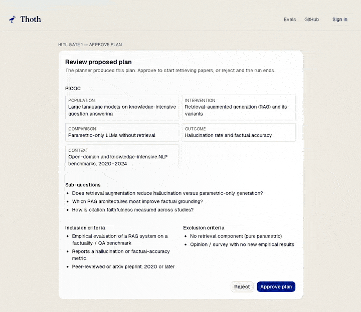

<div align="center">


# Thoth

**Agentic systematic literature reviews — with every citation checked against the source.**

*Named for Thoth, ancient Egypt's ibis-headed god of writing and scribes.*

[](https://thoth-slr.vercel.app)
[](https://thoth-slr.vercel.app/evals)
[](https://registry.modelcontextprotocol.io/v0/servers?search=io.github.ahmedEid1/thoth)
[](docs/architecture.md#tests--verification)
[](CHANGELOG.md)
[](docs/self-host/oracle-cloud-quickstart.md)
[](LICENSE)

**[Try the live demo](https://thoth-slr.vercel.app)** · **[See a sample review](https://thoth-slr.vercel.app/showcase)** · **[Public eval dashboard](https://thoth-slr.vercel.app/evals)** · **[Connect via MCP](#-connect-it-to-your-ai-assistant)**


</div>

---

## What is Thoth?

Systematic literature reviews are slow to write — and when you ask an LLM to write
one, it confidently invents citations and statistics that aren't in any paper.

**Thoth does both halves and checks its own work.** Give it a research question and
it discovers relevant papers, reads them, drafts an evidence-grounded review — then
runs a verification pass (`cite_check`) that compares **every cited claim against the
source paper** and flags anything unsupported *before you read the draft*. The result
is a review with a critic score, a citation-faithfulness percentage, and a per-claim
audit you can trust.

It runs as a polished web app, a public eval dashboard, and an authenticated MCP
server your AI assistant can call directly.

## See it work

**Claude.ai catches 6 fabricated citations in a real draft — using Thoth's audit:**

<div align="center">

</div>

> Connected to Thoth via the [official MCP Registry](https://registry.modelcontextprotocol.io/v0/servers?search=io.github.ahmedEid1/thoth), Claude calls `get_citation_audit` on **one deliberately-weak review** (faithfulness 0.13 for that single review) and identifies all 6 unsupported claims — every one citing the same paper, with invented percentages that aren't in the source. This is `cite_check` doing its job: it's a single-review audit sample, not the golden-set aggregate (see [`/evals`](https://thoth-slr.vercel.app/evals)).

**Every claim, scored against its source** — the `/showcase` review (no login needed). The figures on this card (critic 4.2/5, faithfulness 75%, 8/8 citations checked, 2 unsupported) are **this one review's** scores — a worked example, not the aggregate:

<div align="center">

</div>

**Evaluated in public** — [`/evals`](https://thoth-slr.vercel.app/evals) tracks citation recall / precision / faithfulness / coverage over an 18-question versioned golden set (7 of 18 populated at this commit), regenerated in CI and published with the last-run date, so a regression is a public, falsifiable signal:

<div align="center">

</div>

**You approve every step** — three human-in-the-loop gates (review plan → review discovered papers → approve included papers); nothing runs unattended:

<div align="center">

</div>

## Key features

- **🔎 `cite_check` — verifiable citations.** Every `[paper_id]` in the draft is
  scored against the cited paper and labelled supported / unsupported / unclear,
  so the LLM can't quietly hallucinate a citation. On the public golden set, the
  citations it *does* surface are accurate — **citation precision 97%, recall 74%**
  — and the verdict report is published per claim, not summarised away. This is the
  core differentiator: the citations are measured, not asserted.
- **🌐 Outbound web search (v2 — under active evaluation).** An outbound
  `discoverer → fetcher → screener` path is wired across **OpenAlex**, **arXiv**, and
  **Exa**: it fetches open-access PDFs, OCRs them, and screens each against your plan,
  so you can run uploaded-only, hybrid, or fully autonomous discovery. The discovery
  and screening axes are **v2 and still being calibrated** — they're tracked openly on
  [`/evals`](https://thoth-slr.vercel.app/evals) (both currently at 0%) rather than
  shipped as a silent claim.
- **🔌 Authenticated, registered MCP server.** OAuth 2.1 + PKCE + Dynamic Client
  Registration via Clerk, SHA-256 audit logging, rate limits — listed in the
  [official MCP Registry](https://registry.modelcontextprotocol.io/v0/servers?search=io.github.ahmedEid1/thoth).
  Most public MCP servers ship with no auth; this one doesn't.
- **📊 Public eval dashboard.** Recall / precision / faithfulness / coverage over a
  versioned golden set, regenerated in CI and stamped with the last-run date, rendered at
  [`/evals`](https://thoth-slr.vercel.app/evals) — an eval regression is a *public*
  signal, not a hidden one.
- **💸 6 LLM providers, $0/mo by default.** Swap providers with one env var; the Mistral
  free tier runs the whole thing, and the entire stack deploys on free tiers for
  **$0/mo**.

## 🚀 Quickstart

**Try it now (nothing to install):**
- **[Open the live demo →](https://thoth-slr.vercel.app)** and build a review, or
  **[browse a finished one →](https://thoth-slr.vercel.app/showcase)**.

**Connect it to your AI assistant** — paste this into claude.ai (Pro/Max), Claude
Desktop, Cursor, or any MCP client (OAuth runs in your browser; no token to copy):

```
https://thoth-slr.vercel.app/api/mcp/mcp
```

<details>
<summary>Read-only MCP tools (scoped to your account)</summary>

- `list_reviews` — your reviews with critic + faithfulness scores
- `get_review_draft` — the markdown draft of a completed review
- `get_citation_audit` — the per-claim cite_check verdict report
- `list_discovered_papers` *(v2)* — papers the discoverer surfaced, with fetch + screening status
- `get_search_queries` *(v2)* — the queries the discoverer generated + per-provider errors

Full reference: [`docs/mcp/tools.md`](docs/mcp/tools.md) · auth + audit model: [`docs/mcp/security.md`](docs/mcp/security.md)
</details>

<div align="center">

<br/><em>Adding Thoth as a custom connector in claude.ai — OAuth runs in your browser (Clerk + DCR), no token to copy.</em>
</div>

**Run it locally:**

```bash
git clone https://github.com/ahmedEid1/thoth.git && cd thoth
cp .env.example .env        # Clerk + Trigger.dev keys + MISTRAL_API_KEY
docker compose up -d        # postgres, minio, langfuse
pnpm install && pnpm prisma migrate dev
pnpm dev                    # Next.js on :3000
pnpm dev:trigger            # Trigger.dev worker (separate terminal)
```

Full setup, the agent pipeline, and the v2 flow: **[docs/architecture.md](docs/architecture.md)**.

## Proof

| | |
|---|---|
| **Live app** | [thoth-slr.vercel.app](https://thoth-slr.vercel.app) (Clerk sign-in) · sample review at [`/showcase`](https://thoth-slr.vercel.app/showcase) |
| **Public evals** | [`/evals`](https://thoth-slr.vercel.app/evals) — **citation precision 97%, recall 74%** on a versioned 18-question golden set (7 of 18 populated at this commit; faithfulness 38% / coverage 32% tracked in the open as the set fills out; discovery/screening v2 under calibration). Regenerated in CI, published with the last-run date — a regression is a public signal. |
| **MCP Registry** | [`io.github.ahmedEid1/thoth`](https://registry.modelcontextprotocol.io/v0/servers?search=io.github.ahmedEid1/thoth) — `status: active` |
| **Tests** | 676 unit/integration + 22 live e2e against the deployed instance (MCP transport, real-browser, authenticated walkthroughs, full agent runs) — all green; tsc + lint clean |
| **Audit log** | Every MCP call recorded with a SHA-256 input hash; no raw input stored |
| **Deploy cost** | $0/mo — Vercel + Neon + Cloudflare R2 + Langfuse + Trigger.dev, all free tiers ([self-host option](docs/self-host/oracle-cloud-quickstart.md)) |

## For engineers

Thoth is a **LangGraph** `StateGraph` driven by a **Trigger.dev** worker, with durable
human-in-the-loop gates, a per-run cost cap, and exactly-once gate delivery. Next.js 16
+ TypeScript (strict), Postgres + Prisma, Clerk auth (web + OAuth 2.1 for MCP),
S3-compatible storage, Mistral OCR, Langfuse tracing.

- **[Architecture](docs/architecture.md)** — the agent pipeline, full stack, v2 flow, tests
- **[LLM providers](docs/llm-providers.md)** — the 6-provider matrix + resilience knobs
- **[MCP tools](docs/mcp/tools.md)** · **[MCP security](docs/mcp/security.md)**
- **[Security & privacy](docs/security-and-privacy.md)** — data inventory, jurisdictions, deletion paths
- **[Self-host](docs/self-host/oracle-cloud-quickstart.md)** — one VM on Oracle Cloud Always Free
- **[Changelog](CHANGELOG.md)** · **[Releasing](RELEASING.md)**

## Credits

Ibis icon by [Delapouite](https://delapouite.com/) under [CC BY 3.0](https://creativecommons.org/licenses/by/3.0/), via [game-icons.net](https://game-icons.net/1x1/delapouite/ibis.html).

## License

[MIT](LICENSE) © 2026 Ahmed Hobeishy
